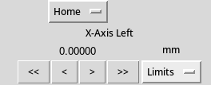
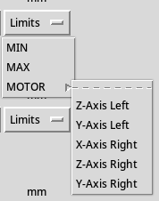

# Keck-XrayImaging
Real Space XRay Imaging

# Install
## Windows
Download all files from github repository then run
```
pip install -r requierments.txt
```
Follow these additional [install instructions](https://github.com/qpit/thorlabs_apt) (Only the Window/System32 directory seems to work)

The program should now run

## Linux
Download all files from github repository then run
```
pip install -r requierments.txt
```
Go [here](https://github.com/kzhao1228/pystage_apt/tree/master)
You will need to download the /stage/motor_ctrl/MG17APTServer.ini file as for some reason pip does not download it.
You will need to find the install location of the pystage_apt module and the place the afomentioned file in <location>/stage/motor_ctrl/

You will then need to go into /stage/motor_ini/core.py
and in the 
```
        try:
            #FIXME: this avoids an error related to https://github.com/walac/pyusb/issues/139
            #FIXME: this could maybe be solved in a better way?
            dev._langids = (1033, )
            # KDC101 3-port is recognized as FTDI in newer kernels
            if not (dev.manufacturer == 'Thorlabs' or dev.manufacturer == 'FTDI'):
                ### raise Exception('No manufacturer found')
                continue ### until the device is found
        except usb.core.USBError:
            print("No stage controller found: make sure your device is connected")
            break
```
change the "break" to a "continue", this fixes an issue where the scanning of stages stops when it finds any usb item that isn't stage, this includes the camera built into most laptops

After these changes are made the program should run without issues.

# How to use
## General overview
When you open up the application there will be a short delay while the program finds the stages connected to the computer. The only time the program scans for stages is on start up.

When a stage is found there should be a control pannel the looks like this:
        

        
This control pannel contains all the information about the stage. It contains at the top a dropdown of positions that the stage can go to. Then below that there is the name of the stage, which you can edit by left clicking on it. Then below that is the current position of the stage, you can tell the stage where to go by clicking on the position. The position reports in mm with percision to 10 nm as the stages are rated to within 30 nm percision. Below the position is the walk and stepping buttons. The "<<" and ">>" walk the stage by holding down the button. The "\<" and "\>" step the stage by 30 nm per press, the step appont can be changed in a saved config, but not in the program itself. Next to the walking and stepping is the limit setter, which allows for setting manual limits to the motor.
        
## More detail

        
The position dropdown has the default buttons of "+" which adds a new named position at the current stage position, "Home" which homes the stage, and "Set Home" which sets the stages home to the current position. When a new position is added it get added to the bottom of the drop down and can be clicked to tell the mstage to go to that position at any point. Positions can only be deleted by editing the save file.
        

        
The limit dropdown contains the different types of limits which can be set. The MIN and MAX limits allows you to set the minnimum and maximum distance of the stages in mm. The MOTOR limit allows you to set limits between two stages. The limits distance is the current distance between the two stages. There are two types of motor limits, parallel and antiparallel. To create a parallel limit type in "p", "parallel", "+", "1", or "same" in the dialog box. Parallel motors currently only work when the "left" motor is behind the "right" motor, or when the "left" motor  can extend into the "right" motor. To create an antiparallel motor type in anyhting elxe into the dialog box. Anti parallel motros work with any two stages.


You can type into the input box of a dialog. By pressing "confirm", or either enter key you will submit the value in the dialog box. If you press the esc key, "Cancel" or "X" the value in the dialog will be discareded.
        
## Config file
A config file is created by saving the current setup of stages, by going File --> Save. It is saved as a JSON file. To load a config file got to File --> Load.
        
Each stage is saved as the stage's serial number. The fields are as follows:
- The user created name of the stage
- The minimum step size in mm
- The list of positions
..- Each position is it's name followed by the position that the motor should go to.
- The list of limits
..- Each limit type has a number, where 0 is MIN, 1 is MAX, and 2 is MOTOR
....- Motor limits are saved as the serial number of linked stage followed by the distace between the two stages at time of creation, wheter of not the limit is parallel "-1" or antiparallel "1", the left stage (serial number and position at time of creation) and the right stage (serial number and position at time of creation)
        
Example of an entry in the config is:
```
  "27264725": {
        "name": "X-Axis Left",
        "step": 3e-05,
        "positions": {
            "Reset Position": 21.0
        },
        "limits": {
            "0": 0.0,
            "1": 22.0,
            "2": {
                "27263725": {
                    "dist": 10.0,
                    "parallel": -1,
                    "left": [
                        27264725,
                        12.0
                    ],
                    "right": [
                        27263725,
                        2.0
                    ]
                }
            }
        }
    }
```
# Additional
If the stages are removed from wall power they must be rehomed before use. The homing must be preformed at the stage controller not in the software. If not homed the stages will over volt when told to go to a position an must be powered off and on to fix the over volt, then homed.
